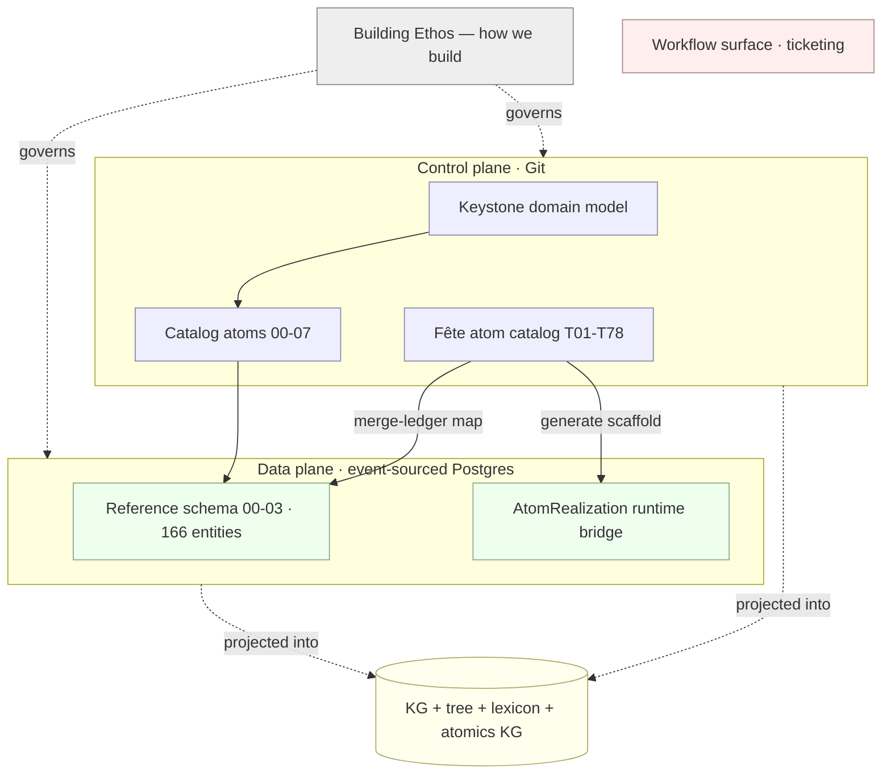

# Unspun — Data Architecture · v2.1

The front door to the data architecture: what exists, how it fits, where to look, and how
to regenerate it. **Versioned**; [`VERSION`](./VERSION) is the single source of truth for the
number, which every generator reads and stamps into its output.

> **One sentence:** a human‑fronted, AI‑backed event‑service platform modeled as a
> **noun‑graph** (objects/data) and a **verb‑graph** (Fête process atoms), composed across
> two planes (Git control plane · event‑sourced Postgres data plane), with every artifact
> generated as a *projection of one truth*.

## Version history

| Version | What changed |
|---|---|
| **v1.0** | Domain keystone, data model (catalog + SQL), reviews, ethos, ADR‑0001, KG + tree. |
| **v2.0** | Fête merge bridge: `Atom`/`Outcome`/`AtomRealization`/`SensoryCue`/`ChildFlowStation`, `automation_quadrant`, the 78‑atom merge ledger + unified graph. |
| **v2.1** | `GuestFamily` (a guest is never singular); master lexicon; atomics KG; Mermaid fixes. |

## The architecture in one picture



## Map of the corpus

### `design/` — the system design (the *how it's built & run*)
The standard SDD set — see its [`README.md`](./design/README.md): system design (HLD),
C4 views, components, runtime flows, API & events, NFRs, security & privacy, deployment & ops.

### `spec/` — the domain (the *what*)
| File | Purpose |
|---|---|
| [`domain-keystone.md`](./spec/domain-keystone.md) | Anchoring object model: 12 contexts × 8 archetypes, identity rules, relationships, state vocabularies. |
| [`glossary.md`](./spec/glossary.md) | Alphabetical object index + ID‑prefix registry. |
| [`building-ethos.md`](./spec/building-ethos.md) | The *how* — six tenets (determinism, verify/ensemble, two formats, small steps, minimal layers, atoms→molecules). |
| [`mece-review.md`](./spec/mece-review.md) | Structural critique (MECE) + the Context × Archetype recut. |
| [`gaps-and-clarity-review.md`](./spec/gaps-and-clarity-review.md) | Completeness/clarity QA + **Addendum A (Brian Chesky)** delight‑centric capture. |

### `data-model/` — the schema (the *concrete shapes*)
See its own [`README.md`](./data-model/README.md). Atoms (YAML) compose into the SQL molecule.
| Part | Purpose |
|---|---|
| `catalog/00-07.yaml` | Authoritative format‑neutral atoms (value types, ~166 entities, **07 = merge bridge**). |
| `sql/00-03.sql` | Postgres reference molecule (enums, kernel types, all tables, **03 = merge bridge**). Run `00→01→02→03`. |

### `decisions/` — the substrate
| File | Purpose |
|---|---|
| [`ADR-0001-system-data-substrate.md`](./decisions/ADR-0001-system-data-substrate.md) | Git vs Jira vs build → hybrid: control plane (Git) + system of record (Postgres) + workflow surface. |

### `reconciliation/` — the merge (old ↔ new)
| File | Purpose |
|---|---|
| [`fete-unifying-model.md`](./reconciliation/fete-unifying-model.md) | Unifies the three Fête artifacts into one atom graph (FUM). |
| **[`merge-analysis.md`](./reconciliation/merge-analysis.md)** | **How to interface the collective old (Unspun) vs new (Fête) data shapes — Option B, with Addendum B (partner review & amendments). Start here for the merge rationale.** |
| [`merge-procedure.md`](./reconciliation/merge-procedure.md) | The six‑pass, gated procedure for bringing them together (RECONCILE · BRIDGE · GENERATE/GOVERN/MEASURE). |
| [`crosswalk.yaml`](./reconciliation/crosswalk.yaml) | Machine‑readable Fête↔Unspun mapping (status‑tagged). |
| [`merge-ledger.yaml`](./reconciliation/merge-ledger.yaml) · [`merge-map.md`](./reconciliation/merge-map.md) | The 78‑atom map (42 EXISTING · 24 DECOMPOSE · 12 NEW), every atom kept. |
| [`atomics-kg.md`](./reconciliation/atomics-kg.md) · `atomics-kg.json` | The atoms and where they map (per‑arc, by quadrant). |
| `unified-graph.json` · `fete-graph.json` | Machine graphs (nouns+verbs joined on `atom_code`; the Fête verb‑graph). |
| `sources/` | The three original Fête artifacts, preserved. |

### `graph/` — the projections (generated; don't hand‑edit)
| File | Purpose |
|---|---|
| [`knowledge-graph.md`](./graph/knowledge-graph.md) · `kg.json` | The logic graph (8 Mermaid views; v2.1 — 197 nodes/169 edges). |
| [`system-tree.md`](./graph/system-tree.md) | Belief→domain→logic→architecture→merge→corpus hierarchy. |
| [`lexicon.md`](./graph/lexicon.md) | **Versioned master index of every name** (~348 terms) + prefix registry. |
| `entities-by-context.md` | Generated entity enumeration by context × archetype. |
| `build_kg.py` · `build_lexicon.py` | Generators. |

## Regeneration (deterministic projections)

```
python3 docs/graph/build_kg.py            # kg.json + entities-by-context.md
python3 docs/graph/build_lexicon.py       # lexicon.md
python3 docs/reconciliation/build_fete_graph.py   # fete-graph.json
python3 docs/reconciliation/build_merge.py        # merge-ledger/map, unified + atomics graphs
```
Authoritative sources are the `spec/` docs and `data-model/catalog/`; everything in
`graph/` and the `*-graph.json` files are projections — regenerate, never hand‑edit.

## Reading order

1. **`building-ethos.md`** (the lens) → 2. **`domain-keystone.md`** (the model) →
3. **`data-model/README.md`** (the schema) → 4. **`ADR-0001`** (the substrate) →
5. **`merge-analysis.md`** (interfacing old vs new — incl. the partner amendments) →
6. **`merge-procedure.md`** (how the merge runs) → 7. `graph/` + `lexicon.md` (navigate it all).

## Conventions (quick reference)

Prefixed ULID ids (`evt_…`); context × archetype on every entity; value objects in the
kernel; append‑only signals; provenance + consent on sourced data; versioned masters;
additive + reversible bridges. Full detail in [`data-model/README.md`](./data-model/README.md).
