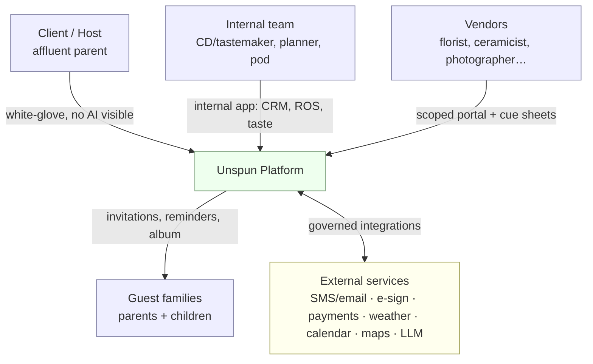
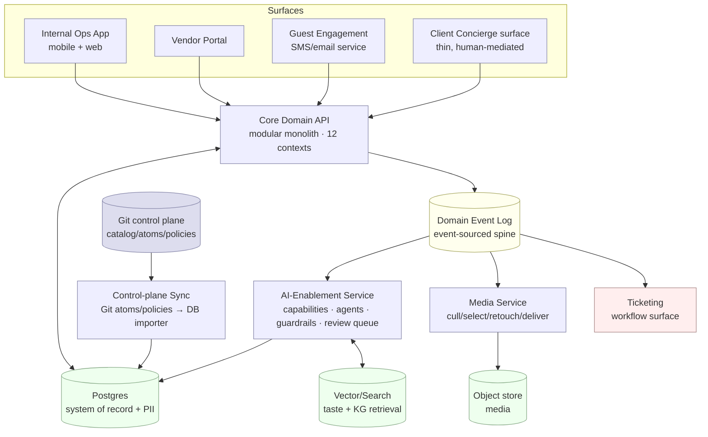
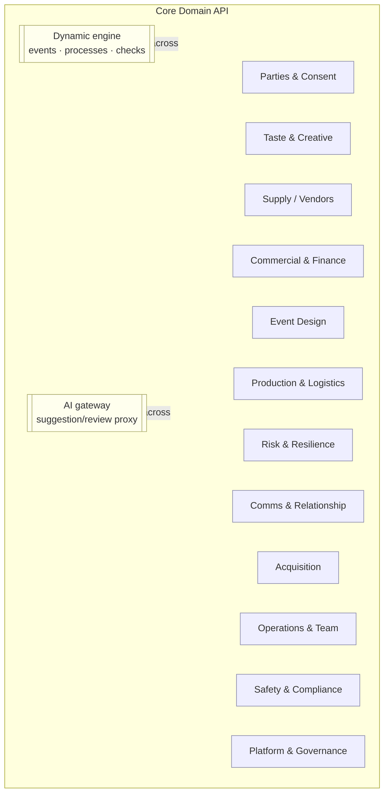

# Architecture — C4 Views · v2.1

**Version:** v2.1 · part of the [System Design set](./README.md).

## L1 — System Context

The customer perceives **people and craft**; AI and back-of-house never cross the membrane.

## L2 — Containers

**Container responsibilities** are detailed in [`components.md`](./components.md).

## L3 — Components (Core Domain API)

One module per bounded context; the dynamic + AI layers are cross-cutting.

Each module owns its tables (the context's entities), publishes/consumes `DomainEvent`s, and
calls the **AI gateway** only — never an LLM directly — so the guardrail is unavoidable.

## Boundaries that matter

- **The membrane** (G1 stage/BoH): client/guest surfaces render only stage-grade artifacts;
  AI-Enablement, Media internals, ticketing, and Git never surface to the customer.
- **The plane boundary** (ADR-0001): `SYNC` is the *only* writer that turns Git definitions
  into DB masters; runtime never edits definitions.
- **The trust boundary** (security): Vendor Portal and Guest Engagement are externally exposed
  and row-scoped; the Internal Ops App is staff-only; see [`security-privacy.md`](./security-privacy.md).
