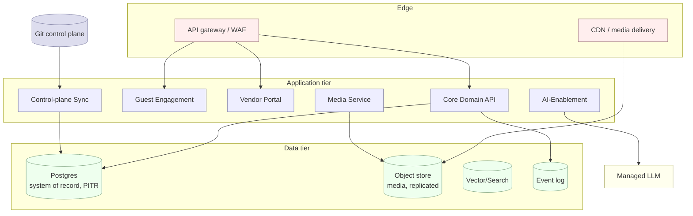

# Deployment & Operations · v2.1

**Version:** v2.1 · part of the [System Design set](./README.md).

## 1. Topology

## 2. Environments

| Env | Purpose | Data |
|---|---|---|
| **dev** | feature work | synthetic only; no real PII |
| **staging** | pre-prod, integration | masked/synthetic; real integrations in sandbox |
| **prod** | live events | real; full governance + backups |

Promotion is via Git (control plane) + CI; the **atom catalog/policies deploy as data**
through `Control-plane Sync`, version-pinned. Config-as-code; secrets via vault per env.

## 3. CI / quality gates (Ethos T2, applied to the repo)

On every PR to the docs/data corpus, CI should:
- parse all `catalog/*.yaml` + `crosswalk.yaml` + `merge-ledger.yaml`;
- run the generators (`build_kg`, `build_lexicon`, `build_fete_graph`, `build_merge`) and
  **fail on drift** (generated files differ from committed);
- lint Mermaid (no multi-`classDef` lines), check ID-prefix uniqueness, validate FK targets
  exist, confirm all 78 atoms dispositioned and the 15 HUMAN atoms present;
- (app) unit/contract tests on event payloads and API schemas.

## 4. Observability (two formats, one truth — Ethos T3)

- **Machine:** structured logs, metrics, traces; `DomainEvent`/`AuditEvent`/`Invocation`
  streams; `CheckResult` records.
- **Human:** dashboards and the **attention matrix** (urgency × importance) — only what
  matters, ranked; `Alert`s route by priority. Internal alerts are distinct from client
  `Message`s.
- **Golden signals per service** + domain SLIs: named-channel response time, day-of cue
  slippage, album delivery time, conformance %, drift count, AI review-queue depth, governance-
  gate rejections.

## 5. Conformance & drift (the bridge's health)

- **Conformance:** % of required atoms realized per event (target 100% of the 15 HUMAN);
  surfaced per engagement and as a fleet metric.
- **Drift:** atom catalog (Git) vs realized runtime — flags dead templates (never realized)
  and un-templated runtime work (no `atom_code`). Runs on import and nightly.

## 6. Reliability & DR

- **Backups:** Postgres PITR (RPO ≤ 5 min); object store cross-region replication; **Git is
  the control-plane DR** (catalog/atoms/policies are inherently versioned & recoverable).
- **RTO ≤ 1h** via infrastructure-as-code rebuild + restore.
- **Day-of resilience:** the internal app caches the run-of-show and cue sheet on-device;
  comms queue and retry; contingency sagas pre-named; degraded mode is read-only + manual.

## 7. Runbooks (index — to be authored as ops matures)

Incident response · consent-withdrawal/erasure execution · day-of degraded mode · LLM-provider
outage (fall back to HUMAN/AUG-HITL, queue AUTO) · vendor no-show substitution · album-pipeline
failure · drift remediation. Each runbook references the relevant `Process`/`Contingency` and
the failure-mode column of the affected atoms.
