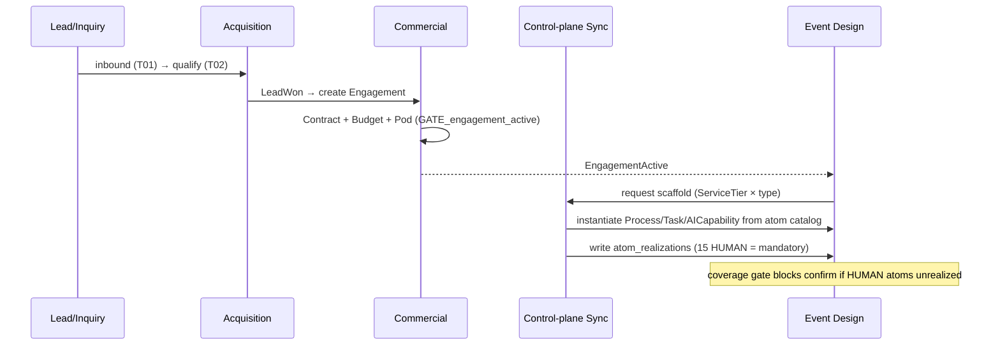
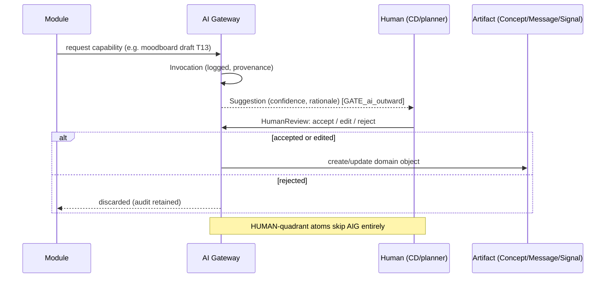
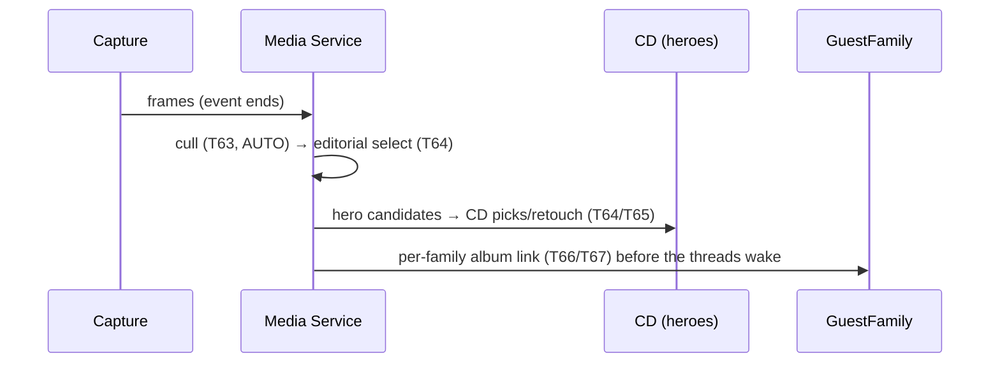

# Runtime Flows · v2.1

**Version:** v2.1 · part of the [System Design set](./README.md). The load-bearing journeys,
end to end. Each is driven by `DomainEvent`s and gated where the corpus says it must be.

## F1 — Intake → Event instantiation (catalog generates runtime)



## F2 — AI guardrail (nothing reaches the customer un-reviewed)



## F3 — Governance-bound enrichment (consent at the edge, not inherited)

```mermaid
sequenceDiagram
  participant PAR as Parties & Consent
  participant AIG as AI Gateway
  participant DB as Postgres (trigger)
  PAR->>AIG: enrich/infer (T03/T04/T05) on a household with a minor
  AIG-->>PAR: Suggestion (ProfileSignal candidate)
  PAR->>DB: write atom_realization + ProfileSignal
  DB-->>PAR: REJECT unless consent_id + lawful_basis present (GATE_atom_consent)
  Note over PAR,DB: scraped/inferred on minors requires guardian Consent + SourcePolicy
```

## F4 — Confirmation saga (cross-aggregate gate)

```mermaid
sequenceDiagram
  participant DEV as DomainEvent
  participant PC as ConfirmationProcess
  participant EVD as Event
  DEV->>PC: BudgetFunded / VenueSecured / PermitGranted / ConceptApproved
  PC->>PC: evaluate GATE_event_confirm
  alt all satisfied
    PC->>EVD: transition → confirmed (StateTransition)
  else missing
    PC-->>EVD: stay; raise Alert (attention matrix)
  end
```

## F5 — Day-of contingency (hostess-shielded)

```mermaid
sequenceDiagram
  participant WW as WeatherWatch
  participant RC as RainCallProcess
  participant P as Planner-on-ground
  participant H as Host
  WW->>RC: EnvThresholdBreached (wind/precip)
  RC->>RC: select pre-named Contingency branch
  RC->>P: execute (move indoors / tent); decision-rights owner ≠ host
  RC--xH: host NOT on the escalation list (don't-tell-hostess tier)
  Note over RC,H: recovery invisible; Incident logged for post-mortem
```

## F6 — Memory pipeline (same-night album race)



## F7 — Merge import (Git atoms → runtime masters)

```mermaid
sequenceDiagram
  participant GIT as Git (atoms/policies)
  participant SYNC as Control-plane Sync
  participant DB as Postgres masters
  GIT->>SYNC: catalog change (merge-ledger.yaml)
  SYNC->>DB: upsert atoms/outcomes (idempotent on code,version)
  SYNC->>DB: refresh CheckDefinitions for G3/HUMAN/AUG-HITL atoms
  Note over SYNC,DB: one-way; instances pin atom_version; new version via ChangeOrder
```

Conformance & drift validators run on every import (and in CI) — see
[`deployment-and-ops.md`](./deployment-and-ops.md).
