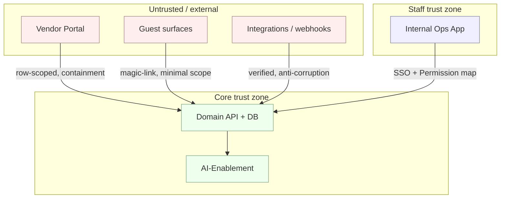

# Security & Privacy Architecture · v2.1

**Version:** v2.1 · part of the [System Design set](./README.md). This is the highest-stakes
design area: the subjects include **minors** and discreet, high-profile clients.

## 1. Data classification (the `sensitivity` scale)

`public · internal · confidential · restricted · minor_protected` (kernel enum). Every
sourced datum carries `sensitivity` + `provenance` + (where applicable) `consent_id`.
`minor_protected` is default-on for `Celebrant` and child `Guest` data and triggers the
tightest handling.

## 2. Trust boundaries

## 3. Threat model (STRIDE, by boundary)

| Threat | Where | Mitigation |
|---|---|---|
| **Spoofing** | vendor/guest auth | scoped accounts; magic-links w/ expiry; MFA for staff/elevated |
| **Tampering** | events, money, contracts | append-only logs; signed `Document`s; optimistic concurrency |
| **Repudiation** | AI actions, approvals | `AuditEvent`, `Invocation`, `HumanReview` immutable records |
| **Information disclosure** | minors' PII, discretion, vendor cross-talk | `sensitivity` redaction; row-level scope; `ContainmentPolicy`; `DiscretionPolicy` gates outward use |
| **Denial of service** | guest/album bursts, day-of | burst services + rate limits; pre-staged pipelines; offline-first day-of |
| **Elevation of privilege** | staff/vendor scope creep | Permission map (role × action × object); deny-by-default; periodic access review |

## 4. Enforcement points (where policy is *code*, not prose)

- **`GATE_atom_consent`** (DB trigger): a `governance_bound` atom realization (T03–T05, any
  inferred/enriched/scraped) is **rejected** without `consent_id` + `lawful_basis`.
- **`GATE_ai_outward`**: no AI `Suggestion` becomes a client/guest/vendor artifact without an
  accepted/edited `HumanReview`; HUMAN-quadrant ⇒ no AI in loop.
- **`DiscretionPolicy` / `MediaPolicy`**: gate every outward use (Showcase, Referral,
  testimonial, minor imagery); anonymization derived from `DiscretionLevel`.
- **`ContainmentPolicy`**: vendors get scoped data, no client contact, fallback required.
- **`SourcePolicy`**: scraping/enrichment allow-list; minors default-deny.
- **`RetentionPolicy`**: per-category expiry; tighter for minors; drives purge.

## 5. Consent & right-to-erasure

- Consent is granular, revocable, versioned (`Consent`); withdrawal **excludes** dependent
  `ProfileSignal`s from all profiles/models immediately (soft-delete, audit-retained).
- **Erasure** runs on the data plane only (Postgres purge + object-store delete +
  vector-store re-index); `AuditEvent` keeps a non-PII tombstone (who/when/what-category).
  This is precisely why PII never lives in Git or a SaaS-of-record (ADR-0001).

## 6. AI-specific controls

`PolicyGuardrail` constrains capability scope, autonomy ceiling, data access, and lawful-basis
requirement. LLM provider is isolated behind AI-Enablement; inputs reference governed data
(minimized); `Invocation` logs cost/latency/provenance. The **membrane** (`stage_boh`) keeps
AI and back-of-house out of every customer-perceived surface.

## 7. Secrets, transport, tenancy

TLS everywhere; secrets in a managed vault (never in Git — Git holds *definitions*, not
credentials); media in private object storage with signed, expiring URLs; single-tenant data
model with row-level scoping (households isolated; vendors isolated).
