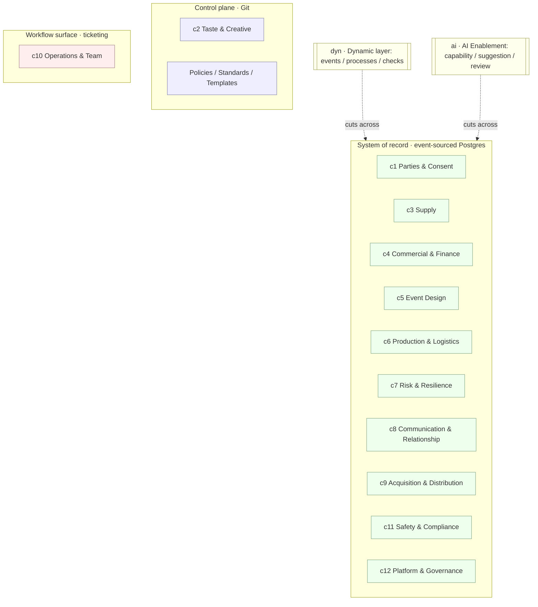
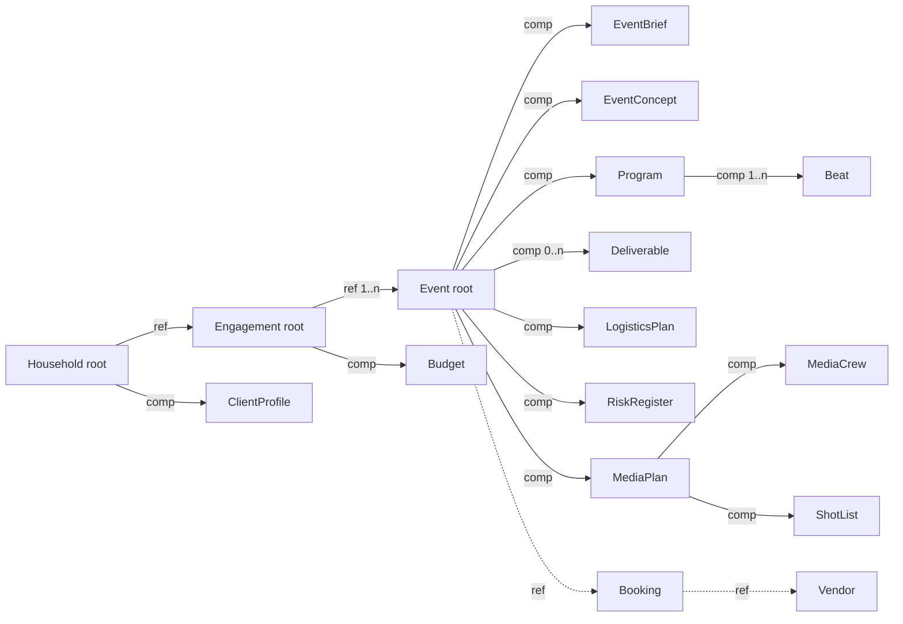
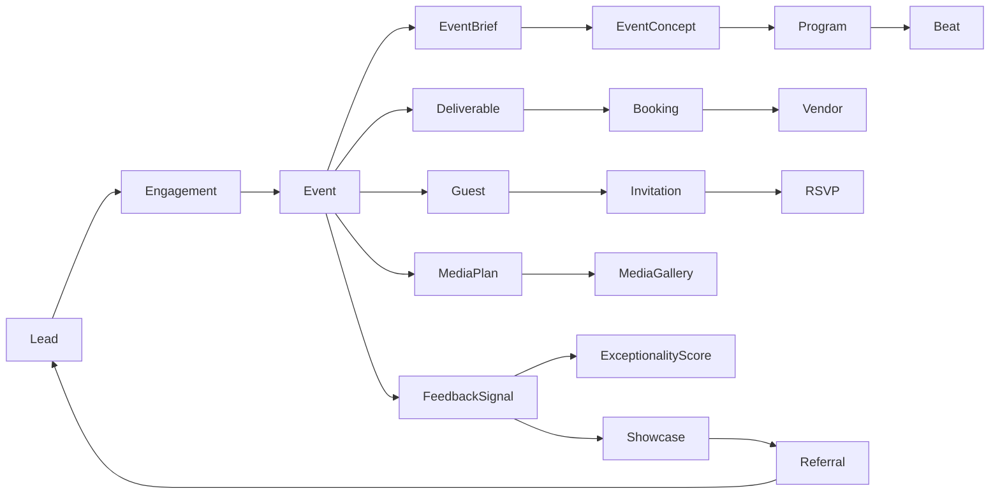
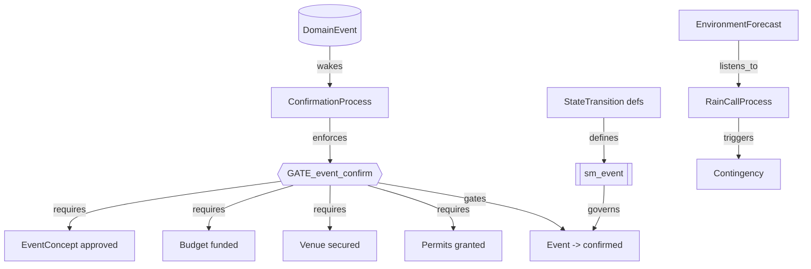
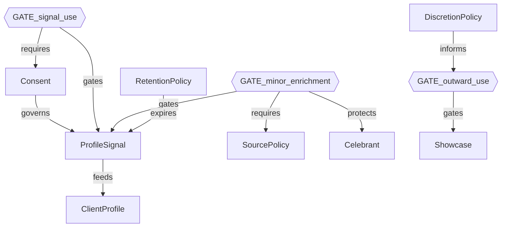
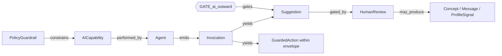
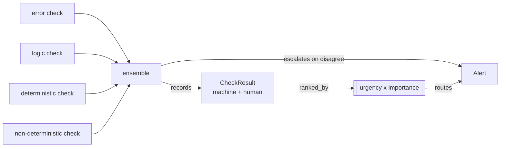

# Unspun — Knowledge Graph · v2.0

A graph of the system's **logic**: how objects connect and the rules that govern them.

- **Machine‑readable (authoritative):** [`kg.json`](./kg.json) — `nodes` + `edges`,
  generated by [`build_kg.py`](./build_kg.py) from the data‑model catalog plus an authored
  *logic layer*. Regenerate; don't hand‑edit. *(v2.0 — 197 nodes, 164 edges, 166 entities.)*
- **Human‑readable (this file):** Mermaid projections of that graph, by view.
- **Companion:** [`system-tree.md`](./system-tree.md) (hierarchy) and the generated
  [`entities-by-context.md`](./entities-by-context.md) (full entity enumeration).

**Version history:** `v1.0` — initial graph (191 nodes / 152 edges). `v2.0` — + Fête merge
bridge (catalog 07): `Atom`, `Outcome`, `AtomRealization`, `SensoryCue`, `ChildFlowStation`
+ the `GATE_atom_consent` gate and the atom↔Task/AICapability/Check/Moment edges (View 8).

This is the Building‑Ethos "two formats, one truth" pattern applied to the graph itself.

## Legend

**Node kinds:** `entity` (catalog object) · `state_machine` · `invariant`/gate ·
`process` (saga) · `logic` (verification/attention) · `plane` (substrate) · `ethos`.
**Edge relations:** structural — `comp` (owns/cascade), `fk`, `ref` (loose by‑id);
logic — `governs`, `gates`, `requires`, `enforces`, `drives`, `emits`, `yields`,
`gated_by`, `feeds`, `triggers`, `listens_to`, `wakes`, `hosts`, `realized_by`.

---

## View 1 — Context map (the 12 contexts + 2 layers, over the 3 planes)



## View 2 — Aggregate composition (the spine)



## View 3 — Lifecycle flow (acquire → design → deliver → remember)



## View 4 — Confirmation gate & processes (the cross‑aggregate logic)



## View 5 — Governance & consent logic (PII, minors, discretion)



## View 6 — AI guardrail logic (abstracted out of the customer's view)



## View 7 — Verification & attention (Ethos T2/T3)



## View 8 — Merge bridge · v2.0 (Fête atoms ↔ this model)

```mermaid
flowchart TB
  ATOM[Atom<br/>T01-T78 template]:::m -->|serves| OUT[Outcome R1-R15]:::m
  TASK[Task] -->|templated_by| ATOM
  AIC[AICapability] -->|templated_by| ATOM
  AIC -->|quadrant_binds| GAI{{GATE_ai_outward}}
  CKD[CheckDefinition] -->|derived_from| ATOM
  MOM[Moment] -->|serves| OUT
  ARZ[AtomRealization]:::s -->|ref| ATOM
  ARZ -->|ref| EVT[Event]
  GAC2{{GATE_atom_consent}} -->|gates| ARZ
  GAC2 -->|requires| CNS[Consent]
  SCUE[SensoryCue]:::n -->|comp| BEAT[Beat]
  CFS[ChildFlowStation]:::n -->|ref| EVT
  classDef m fill:#eef,stroke:#88a; classDef s fill:#ffe,stroke:#aa6; classDef n fill:#efe,stroke:#8a8;
```

*New in v2.0: `Atom`/`Outcome` masters (control plane), `AtomRealization` (runtime bridge,
consent-gated), and the two new objects `SensoryCue` + `ChildFlowStation`. The full
verb-graph join lives in [`../reconciliation/unified-graph.json`](../reconciliation/unified-graph.json).*

---

## Regenerating

```
python3 docs/graph/build_kg.py     # -> kg.json + entities-by-context.md
```
Structural nodes/edges come from `catalog/*.yaml`; the logic layer (gates, processes,
state machines, governance, AI, verification, planes, ethos) is authored inside
`build_kg.py`. Edit the catalog or the logic layer there, then regenerate — never edit
`kg.json` by hand (Ethos: it is a projection, not a source of truth).
