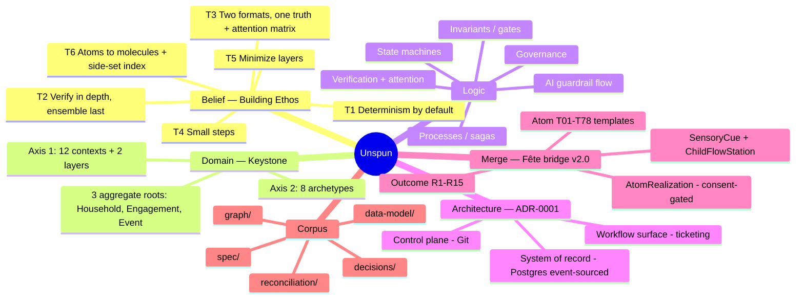

# Unspun — System Tree · v2.0

A single hierarchical view of the whole system: belief → domain → logic → architecture →
**merge** → corpus. The leaf‑level entity enumeration is generated separately in
[`entities-by-context.md`](./entities-by-context.md); the relational logic is in
[`knowledge-graph.md`](./knowledge-graph.md).

**Version history:** `v1.0` — belief/domain/logic/architecture/corpus.
`v2.0` — + §6 Merge (Fête ↔ Unspun bridge): atoms, outcomes, realizations, two new objects.

## Mindmap



## Outline

```
Unspun
├─ 1. Belief layer — Building Ethos  (spec/building-ethos.md)
│   ├─ T1 Determinism by default — non-determinism fenced & guarded
│   ├─ T2 Verify in depth; final pass is an ensemble of independent checks
│   ├─ T3 Two formats (machine + human) from one truth; urgency×importance attention
│   ├─ T4 Many small incremental steps over big leaps
│   ├─ T5 Minimize abstraction layers (optionality > DRY)
│   └─ T6 Atomic particles → molecular recomposition + side-set index
│
├─ 2. Domain model — Keystone  (spec/domain-keystone.md, glossary.md)
│   ├─ Axis 1 — Contexts (ownership)
│   │   ├─ c1  Parties & Consent .............. Household▸ Person, ClientRole, Member,
│   │   │                                        Celebrant, Consent, ProfileSignal, ClientProfile
│   │   ├─ c2  Taste & Creative ............... TasteProfile, Motif, Concept, ConceptVariant,
│   │   │                                        PreferenceModel, Trend, Tastemaker
│   │   ├─ c3  Supply ......................... Vendor, VendorUser, Offering, Quote, Booking,
│   │   │                                        VendorContract, VendorPerformance, Roster
│   │   ├─ c4  Commercial & Finance ........... Engagement▸ Contract, Budget, Invoice,
│   │   │                                        Payment, Deposit, Ledger, PricingPlan, Package
│   │   ├─ c5  Event Design ................... Event▸ EventBrief, EventConcept, Program, Beat,
│   │   │                                        SignatureTouch, Deliverable, Benchmark, Moment
│   │   ├─ c6  Production & Logistics ......... Venue, LogisticsPlan, Task, ResourceAssignment,
│   │   │                                        Asset, Permit, MediaPlan, MediaCrew, ShotList
│   │   ├─ c7  Risk & Resilience .............. RiskRegister, Risk, Contingency,
│   │   │                                        EnvironmentForecast, Incident, ChangeOrder
│   │   ├─ c8  Communication & Relationship ... Guest, Invitation, RSVP, Touchpoint, Message,
│   │   │                                        DelightMoment, FeedbackSignal, Gift, GuestQuery
│   │   ├─ c9  Acquisition & Distribution ..... Lead, Channel, Campaign, Segment, Showcase,
│   │   │                                        Referral, Funnel, Waitlist
│   │   ├─ c10 Operations & Team .............. TeamMember, Role, Permission, Pod, ServiceTier,
│   │   │                                        Playbook, Availability, QualityReview
│   │   ├─ c11 Safety & Compliance ............ Safeguarding, BackgroundCheck, SupervisionPlan,
│   │   │                                        EmergencyPlan, SecurityPlan, MediaPolicy
│   │   ├─ c12 Platform & Governance .......... AuditEvent, Document, Approval, Region, Brand,
│   │   │                                        RetentionPolicy, Alert
│   │   ├─ dyn Dynamic layer .................. DomainEvent, StateTransition, Process,
│   │   │                                        ProcessInstance, CheckDefinition, CheckResult
│   │   └─ ai  AI Enablement .................. AICapability, Agent, Invocation, Suggestion,
│   │                                            GuardedAction, HumanReview, PolicyGuardrail
│   └─ Axis 2 — Archetypes (kind): root · member · party · master · policy · signal ·
│       projection · value     [every entity = one context × one archetype]
│
├─ 3. Logic  (knowledge-graph.md + dyn/ai layers)
│   ├─ State machines ........ engagement, event, booking, quote, permit, task, risk,
│   │                          incident, change, touchpoint, suggestion, consent, lead, …
│   ├─ Invariants / gates .... event_confirm, booking_confirm, engagement_active,
│   │                          ai_outward, signal_use, minor_enrichment, outward_use
│   ├─ Processes / sagas ..... Confirmation, RainCall, Cancellation, ConsentWithdrawal
│   ├─ Governance ............ Consent→ProfileSignal→ClientProfile; Retention; Discretion;
│   │                          MinorProtection; Provenance/LawfulBasis
│   ├─ AI guardrail flow ..... Capability→Agent→Invocation→Suggestion→[HumanReview]→object
│   └─ Verification .......... error|logic|deterministic|non-deterministic → ensemble →
│                              CheckResult(machine+human) → attention matrix → Alert
│
├─ 4. Architecture — ADR-0001  (decisions/)
│   ├─ Control plane ......... Git (master/policy: catalog, playbooks, templates)
│   ├─ System of record ...... event-sourced Postgres (root/party/projection/signal, PII)
│   └─ Workflow surface ...... ticketing (Task/Approval/Incident), swappable, event-driven
│
├─ 5. Merge — Fête ↔ Unspun bridge  v2.0  (reconciliation/ + data-model 07/03)
│   ├─ Verb-graph (Fête) ..... 78 atoms T01-T78, outcomes R1-R15, 9 workstreams, quadrants
│   ├─ Map .................. merge-ledger.yaml — all 78 kept: 42 EXISTING · 24 DECOMPOSE · 12 NEW
│   ├─ Masters .............. Atom (template), Outcome  (control plane)
│   ├─ Runtime bridge ....... AtomRealization (atom_code, version-pinned, consent-gated B6)
│   ├─ New objects .......... SensoryCue (T38), ChildFlowStation (T36/T54)
│   ├─ Bridge columns ....... Task/AICapability.atom_code, AICapability.quadrant,
│   │                          CheckDefinition.atom_code, Moment.serves_outcome_code/stage_boh
│   └─ Unified graph ........ unified-graph.json (KG nouns + atoms via 'realizes')
│
└─ 6. Corpus  (the document map)
    ├─ spec/ ......... domain-keystone, glossary, building-ethos, mece-review,
    │                   gaps-and-clarity-review (+ Chesky addendum)
    ├─ data-model/ ... README, catalog/*.yaml (00-07), sql/*.sql (00-03, incl. merge bridge)
    ├─ decisions/ .... ADR-0001 substrate
    ├─ reconciliation/ fete-unifying-model, crosswalk, merge-analysis (+ partner addendum),
    │                   merge-procedure, merge-ledger, merge-map, build_*.py, *-graph.json
    └─ graph/ ........ build_kg.py, kg.json (v2.0), knowledge-graph.md, system-tree.md,
                        entities-by-context.md
```

> The tree groups the system; the [knowledge graph](./knowledge-graph.md) wires it. The
> entity leaves under §2 are abbreviated here — the complete, generated list lives in
> [`entities-by-context.md`](./entities-by-context.md).
