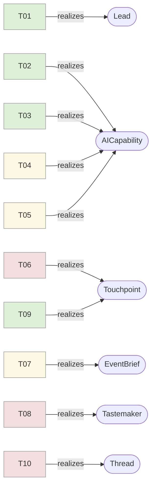
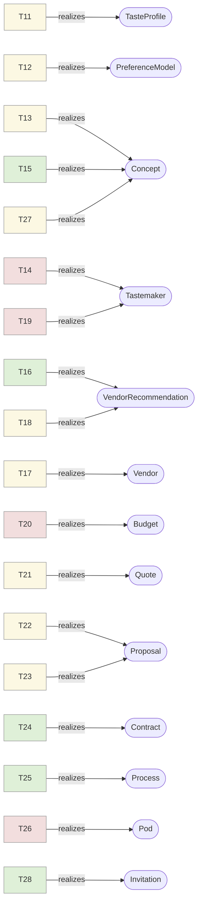
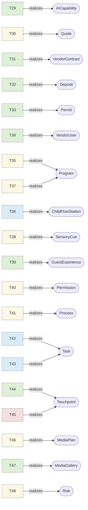
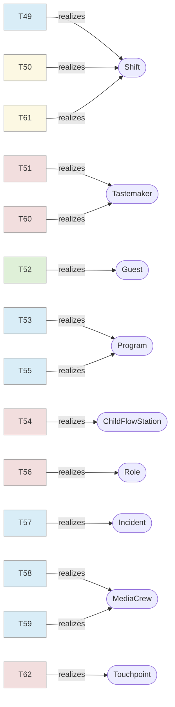
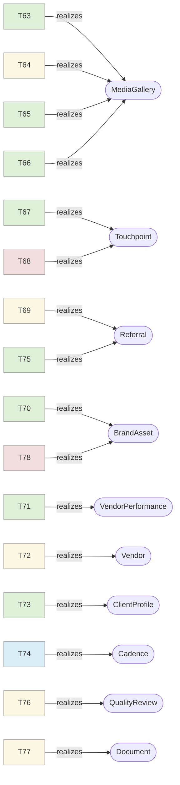

# Atomics KG · tracks v2.1 — the 78 atoms and where they map

> Machine form: [`atomics-kg.json`](./atomics-kg.json). Full join with the noun-graph: [`unified-graph.json`](./unified-graph.json). The 78-atom map: [`merge-ledger.yaml`](./merge-ledger.yaml).
> Each atom `--realizes-->` its **primary** Unspun target (diagram) and `--serves-->` its outcome(s).
> Colour = automation quadrant.

## Arc A — Discovery & Trust (10 atoms)

| Atom | Name | Q | Disp | Realizes (Unspun) | Serves |
|---|---|---|---|---|---|
| T01 | Capture inbound to single qualifie | AUTO | EXISTING | Lead, Inquiry, ContactChannel, AuditEvent | R2 |
| T02 | Qualify against ICP filter | AUTO | EXISTING | AICapability, Lead | R2 |
| T03 | Enrich identity | AUTO | EXISTING | AICapability, ProfileSignal, ClientProfile | R2 |
| T04 | Infer aesthetic posture from publi | AUG-HITL | EXISTING | AICapability, TasteProfile, ProfileSignal | R3, R4 |
| T05 | Detect status / discretion sensiti | AUG-HITL | EXISTING | AICapability, Consent, DiscretionPolicy, SourcePolicy | R6 |
| T06 | Discovery call · conversational, n | HUMAN | NEW-MASTER | Touchpoint, Thread | R2 |
| T07 | Capture stated and unstated brief | AUG-HITL | DECOMPOSE | EventBrief, AICapability | R2, R4 |
| T08 | CD taste arbitration of brief | HUMAN | EXISTING | Tastemaker, EventConcept | R4 |
| T09 | Same-day recap note | AUTO | EXISTING | Touchpoint, Message, MessageTemplate | R2 |
| T10 | Open private channel with named hu | HUMAN | NEW-MASTER | Thread, Touchpoint | — |

## Arc B — Vision & Commit (18 atoms)

| Atom | Name | Q | Disp | Realizes (Unspun) | Serves |
|---|---|---|---|---|---|
| T11 | Synthesize taste vector from intak | AUG-HITL | EXISTING | TasteProfile, PreferenceModel, AICapability | R3, R4 |
| T12 | Identify three axes to push and th | AUG-HITL | DECOMPOSE | PreferenceModel, TasteProfile, AICapability | R4 |
| T13 | Compose moodboard at editorial qua | AUG-HITL | EXISTING | Concept, InspirationSource, AICapability | R3, R13 |
| T14 | CD final pass on moodboard | HUMAN | EXISTING | Tastemaker, Concept, HumanReview | R3, R5 |
| T15 | Write moodboard caption deck | AUTO | EXISTING | Concept, MessageTemplate, AICapability | R3 |
| T16 | Vendor longlist conditioned on tas | AUTO | EXISTING | VendorRecommendation, Vendor, Offering, Roster | R5 |
| T17 | Availability + social-overlap chec | AUG-HITL | DECOMPOSE | Vendor, RelationshipEdge, Segment, ContainmentPolicy | R5 |
| T18 | Shortlist with rationale | AUG-HITL | EXISTING | VendorRecommendation | R5 |
| T19 | Ensemble taste pairing | HUMAN | EXISTING | Tastemaker, Booking | R5, R13 |
| T20 | Surface the dual-budget question | HUMAN | NEW-MASTER | Budget, DiscretionPolicy, Consent | R6 |
| T21 | Pre-negotiate vendor ranges before | AUG-HITL | EXISTING | Quote, Booking, AICapability | R6 |
| T22 | Tiered scope proposal | AUG-HITL | EXISTING | Proposal, PricingPlan | — |
| T23 | Draft proposal as a story document | AUG-HITL | EXISTING | Proposal, Document, MessageTemplate | R2 |
| T24 | Capture commit | AUTO | DECOMPOSE | Contract, Payment, CalendarItem, Engagement | — |
| T25 | Project instantiation | AUTO | EXISTING | Process, Engagement, Pod | — |
| T26 | Planner-on-ground introduced by na | HUMAN | NEW-MASTER | Pod, TeamMember, Touchpoint | R7, R10 |
| T27 | Render the key image | AUG-HITL | EXISTING | Concept, BrandAsset, AICapability | R3 |
| T28 | Invite copy + visual aligned to mo | AUTO | EXISTING | Invitation, MessageTemplate, BrandAsset | — |

## Arc C — Build (20 atoms)

| Atom | Name | Q | Disp | Realizes (Unspun) | Serves |
|---|---|---|---|---|---|
| T29 | Vendor outreach | AUTO | EXISTING | AICapability, Booking | — |
| T30 | Counter-quote handling | AUG-HITL | EXISTING | Quote, Booking, AICapability | R6 |
| T31 | Generate vendor contracts | AUTO | EXISTING | VendorContract, Document | — |
| T32 | Deposits, payment scheduling, invo | AUTO | DECOMPOSE | Deposit, Payment, Ledger, Invoice | — |
| T33 | Insurance, permits, COIs | AUTO | EXISTING | Permit, Document | — |
| T34 | Vendor portal with cue sheet slice | AUTO | EXISTING | VendorUser, VendorAccessRole | R8, R10 |
| T35 | Author run-of-show | AUG-HITL | DECOMPOSE | Program, Beat, LogisticsPlan, Process, Playbook | R7, R8 |
| T36 | Child-flow choreography | HUMAN-AI | NEW-MASTER | ChildFlowStation, Beat | R9 |
| T37 | Parallel-track design | AUG-HITL | DECOMPOSE | Program, Beat | R10 |
| T38 | Sensory cue sheet | AUG-HITL | NEW-MASTER | SensoryCue, Beat | R8 |
| T39 | Allergy + child preference matrix | AUTO | DECOMPOSE | GuestExperience, RSVP, SupervisionPlan, EmergencyPlan | — |
| T40 | Decision-rights pre-assignment | AUG-HITL | DECOMPOSE | Permission, Approval | R1, R7 |
| T41 | Escalation protocol with "don't te | AUG-HITL | NEW-MASTER | Process, Permission, Approval | R1, R7 |
| T42 | Pre-day site walk | HUMAN-AI | EXISTING | Task, Venue, Checklist | R8 |
| T43 | Dry-run cue sheet | HUMAN-AI | EXISTING | Task, Checklist, ChecklistRun | R8 |
| T44 | Hostess one-page day-of brief | AUTO | EXISTING | Touchpoint, MessageTemplate, Document | R1, R7 |
| T45 | CD/CEO evening-before check-in | HUMAN | NEW-MASTER | Touchpoint | R1 |
| T46 | Photo brief with relational geomet | AUG-HITL | DECOMPOSE | MediaPlan, ShotList, RelationshipEdge, MediaPolicy | R11, R13 |
| T47 | Album delivery pipeline pre-stagin | AUTO | EXISTING | MediaGallery | R12 |
| T48 | Contingency triggers | AUG-HITL | DECOMPOSE | Risk, Contingency, Process | R1, R7 |

## Arc D — Day-Of (14 atoms)

| Atom | Name | Q | Disp | Realizes (Unspun) | Serves |
|---|---|---|---|---|---|
| T49 | Vendor arrival staging | HUMAN-AI | DECOMPOSE | Shift, ResourceAssignment, LogisticsPlan | R7 |
| T50 | Staff brief and assignment confirm | AUG-HITL | DECOMPOSE | Shift, ResourceAssignment | R7, R8 |
| T51 | Final aesthetic walk-through | HUMAN | EXISTING | Tastemaker, CheckResult | R11, R13 |
| T52 | Guest arrival management | AUTO | DECOMPOSE | Guest, AccessPass | R11 |
| T53 | Cue execution against ROS | HUMAN-AI | DECOMPOSE | Program, Beat, Process | R8 |
| T54 | Child-flow live management | HUMAN | DECOMPOSE | ChildFlowStation, SupervisionPlan | R9 |
| T55 | Adult-track pacing | HUMAN-AI | DECOMPOSE | Program, Beat | R10 |
| T56 | Hostess shadow | HUMAN | NEW-MASTER | Role, Pod | R1, R7 |
| T57 | In-flight contingency handling | HUMAN-AI | DECOMPOSE | Incident, Contingency, Process | R1, R7 |
| T58 | Live host / family / in-law covera | HUMAN-AI | EXISTING | MediaCrew, Shot | R11, R13 |
| T59 | Editorial coverage | HUMAN-AI | EXISTING | MediaCrew, MediaGallery, BrandAsset | R13 |
| T60 | Real-time taste corrections | HUMAN | EXISTING | Tastemaker, CheckResult | R11, R13 |
| T61 | End-of-event de-stage | AUG-HITL | DECOMPOSE | Shift, LogisticsPlan | — |
| T62 | Hostess send-off | HUMAN | NEW-MASTER | Touchpoint | R1, R14 |

## Arc E — Afterglow & Loop (16 atoms)

| Atom | Name | Q | Disp | Realizes (Unspun) | Serves |
|---|---|---|---|---|---|
| T63 | Same-night photo cull | AUTO | EXISTING | MediaGallery, AICapability | R12 |
| T64 | Editorial selection | AUG-HITL | EXISTING | MediaGallery, Tastemaker | R12, R13 |
| T65 | Color, retouch on hero frames | AUTO | EXISTING | MediaGallery, AICapability | R13 |
| T66 | Album rendered, shared, mobile + d | AUTO | EXISTING | MediaGallery, Document | R12 |
| T67 | Album delivery message | AUTO | EXISTING | Touchpoint, Message | R12, R14 |
| T68 | Personal follow-up | HUMAN | NEW-MASTER | Touchpoint, FeedbackSignal | R14 |
| T69 | Referral activation | AUG-HITL | EXISTING | Referral, AICapability, HumanReview | R14 |
| T70 | Press / portfolio pipeline | AUTO | EXISTING | BrandAsset, Showcase | — |
| T71 | Vendor scoring | AUTO | EXISTING | VendorPerformance, VendorRating | — |
| T72 | Vendor network growth | AUG-HITL | DECOMPOSE | Vendor, Roster | — |
| T73 | Customer dossier update | AUTO | EXISTING | ClientProfile, ProfileSignal | — |
| T74 | Loop hold | HUMAN-AI | DECOMPOSE | Cadence, Touchpoint | — |
| T75 | Referral attribution | AUTO | DECOMPOSE | Referral, LedgerEntry | — |
| T76 | Post-mortem with planner + CD | AUG-HITL | DECOMPOSE | QualityReview, Playbook, KnowledgeAsset | — |
| T77 | Hostess-grade recap doc | AUG-HITL | DECOMPOSE | Document, BrandAsset, MediaGallery | R14 |
| T78 | CD handwritten note on recap doc | HUMAN | NEW-MASTER | BrandAsset | — |

