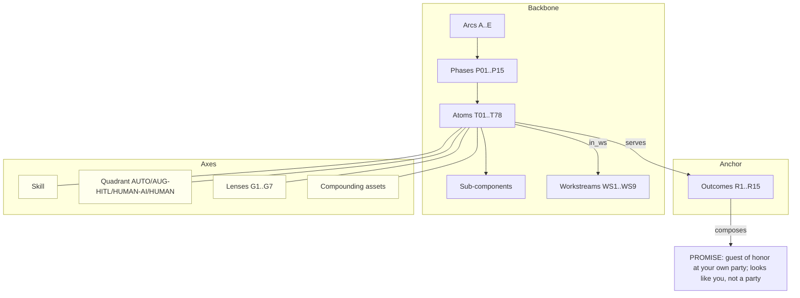

# Fête — Unifying Model (FUM v1)

**Purpose:** unify the three Fête artifacts into one coherent model, built so it can be
**reconciled with the Unspun corpus** (`../spec`, `../data-model`, `../graph`) next.
This document does the *unification*; the Unspun reconciliation is staged (§8) but not yet
executed.

**Sources (preserved in [`sources/`](./sources/)):**
- `fete-process-atlas.md` — the spine: persona, the 5-star review, outcomes R1–R15, the
  layered map (Promise → Arcs → Phases → Workstreams → 78 Atoms), 7 grouping lenses (G1–G7),
  the automation-quadrant scoring, strategic read.
- `fete-atom-decomposition.md` — each atom's WHAT/WHY/sub-components/inputs/outputs/adjacency.
- `fete-experience-atlas-deck.pptx` — a 45-slide onboarding *presentation* of the same content.

---

## 1. The unifying insight

**The three artifacts are three *views* of one graph.** The deck presents it, the atlas
structures it, the decomposition details it — but there is exactly **one** underlying object:
a graph of **78 atoms**, anchored to **15 outcomes (R1–R15)** that compose a **brand promise**,
arranged on a **backbone** (Arc → Phase → Workstream) and classified by several
**orthogonal axes** (skill, automation quadrant, seven lenses, benchmark/failure-mode,
compounding asset, membrane).

So unification = **name that one graph once**, show how each view projects from it, and
give it identity + a machine-readable form. That is FUM. (This is the same "one truth,
many formats" discipline as Unspun's Building Ethos — applied to Fête's own documents.)

A generated projection of the graph lives at [`fete-graph.json`](./fete-graph.json)
(via [`build_fete_graph.py`](./build_fete_graph.py)): **141 nodes, 626 edges, 78 atoms.**

---

## 2. The meta-model (node & edge types)

**Node types**

| Type | What it is | Count | ID form |
|---|---|---|---|
| `promise` | Layer 0 — the immutable one-sentence brand promise | 1 | `PROMISE` |
| `outcome` | A received-experience line from the review (R1–R15) | 15 | `R1`..`R15` |
| `arc` | Customer-journey stage (A–E) | 5 | `Arc:A`..`Arc:E` |
| `phase` | Operational phase (P01–P15) | 15 | `P01`..`P15` |
| `workstream` | Operating lane (WS1–9; 6 agent surfaces + 3 human-led) | 9 | `WS1`..`WS9` |
| `atom` | The indexed unit of work (T01–T78) | 78 | `T01`..`T78` |
| `subcomponent` | 3–6 operational pieces inside an atom | ~360 | `Tnn.k` |
| `skill` | Skill class (TST, LOG, NEG, CRF, CAR, ANL, COM, OPS) | 8 | `SKILL:TST`… |
| `quadrant` | Automation class (AUTO, AUG-HITL, HUMAN-AI, HUMAN) | 4 | `Q:AUTO`… |
| `lens` | A grouping re-cut (G1–G7) | 7 | `G1`..`G7` |
| `asset` | A compounding asset an atom builds | 4 | `ASSET:referral`… |
| `goal` | A non-review served goal (brand, safety, membrane) | 3 | `GOAL:brand`… |

**Edge types**

`composes` (outcome→promise) · `serves` (atom→outcome/asset/goal) · `in_arc` (phase→arc) ·
`in_phase` / `in_ws` / `has_skill` / `in_quadrant` (atom→backbone/axis) ·
`decomposes_into` (atom→subcomponent) · `adjacent` (atom→atom, the data-flow graph) ·
`grouped_by` (atom→lens) · `benchmarked_by` / `fails_as` (atom→benchmark/failure-mode,
carried as atom attributes).

## 3. Backbone (containment) vs axes (classification)

Like Unspun's *context × archetype*, FUM separates **one containment backbone** from
**several orthogonal classification axes** — so every atom has exactly one place on the
backbone and one value per axis.

**Backbone (where an atom lives):** `PROMISE → Arc → Phase → Atom → SubComponent`, with
`Workstream` as the orthogonal operating lane.

**Axes (how an atom is classified):**
1. **Skill** (TST/LOG/NEG/CRF/CAR/ANL/COM/OPS) — what competence it needs.
2. **Quadrant** (AUTO/AUG-HITL/HUMAN-AI/HUMAN) — who operates it and where AI sits.
3. **Lens G1–G7** — the seven design re-cuts (stage/BoH · taste/logistics · reversible/
   brand-destroying · information-artifact · asset-compounding · sensory-channel · cost-driver).
4. **Served outcome(s)** R1–R15 — which felt result it produces.
5. **Benchmark + failure-mode** — the "5-star looks like…" bar and what breaks without it.
6. **Compounding asset** — referral / vendor-network / customer-dossier / playbook (G5).

## 4. Identity & indexing

Atoms `T01–T78`, outcomes `R1–R15`, arcs `A–E`, phases `P01–P15`, workstreams `WS1–WS9`,
lenses `G1–G7`, quadrants `{AUTO, AUG-HITL, HUMAN-AI, HUMAN}`, skills `{TST,LOG,NEG,CRF,
CAR,ANL,COM,OPS}`. These are the stable join keys. Sub-components inherit `Tnn.k`.
Identity is **persona-stable, register-tunable**: the keys don't move when the customer
changes; the *voice* (Caroline's register) is a parameter, not a node.

## 5. How each source view projects from the model

| Source view | Projects | Omits |
|---|---|---|
| **Process Atlas** | backbone + axes + quadrant scoring + strategic read | per-atom sub-components |
| **Atom Decomposition** | atoms + sub-components + adjacency (inputs/outputs) + serves | quadrant *summary* roll-ups |
| **Deck (pptx)** | a linear, section-indexed onboarding walk of all of the above | nothing new — pure presentation |

**Reconciliation finding (within Fête):** the two text sources **disagree on quadrant
tallies.** The Atlas summary reports AUTO 22 / AUG-HITL 28 / HUMAN-AI 13 / HUMAN 15; the
decomposition's per-atom tags compute to **AUTO 26 / AUG-HITL 27 / HUMAN-AI 10 / HUMAN 15**
(HUMAN agrees; the AUTO↔AUG-HITL↔HUMAN-AI boundaries drift on ~6 atoms). FUM treats the
**per-atom decomposition tag as authoritative** and flags the Atlas roll-up as stale — to
be reconciled. This is exactly the kind of drift a unifying model exists to catch.

---

## 6. The model in one picture



---

## 7. The bridge thesis (why this reconciles cleanly with Unspun)

**Fête is the verb-graph; Unspun is the noun-graph.**

- **Fête atoms are *processes/tasks* — verbs** ("synthesize taste vector", "author
  run-of-show", "cull photos"). The atom graph is *how the work flows*.
- **Unspun entities are *objects* — nouns** (TasteProfile, Program, MediaGallery). The
  keystone/data-model is *what the work reads and writes*.

They are complementary planes that **join at four seams**:
1. **Atom ↔ {Process, Task, AICapability, Playbook}** — every Fête atom is an Unspun
   process/task operating on entities (the natural grain match).
2. **Quadrant ↔ AI-Enablement layer** — AUTO/AUG-HITL/HUMAN-AI/HUMAN map onto
   `AICapability.autonomy`, `Suggestion → HumanReview`, `GuardedAction`, and
   `GATE_ai_outward`. Fête's quadrant *is* Unspun's AI guardrail, scored.
3. **Outcome R1–R15 + Benchmark ↔ ExperienceStandard / ExceptionalityScore / Moment** —
   Fête's felt results are Unspun's quality rubric and journey frames.
4. **Compounding assets ↔ the data plane** — referral→`Referral`/`Showcase`,
   vendor-network→`VendorPerformance`/`Roster`, dossier→`ClientProfile`, playbook→`Playbook`.

This is the reconciliation map. The machine-readable, status-tagged version is
[`crosswalk.yaml`](./crosswalk.yaml).

## 8. Reconciliation procedure (to execute next)

1. **Graph-align** `fete-graph.json` (verbs) against `../graph/kg.json` (nouns) using
   `crosswalk.yaml` as the join.
2. **Per-seam pass** (the four seams above): confirm every atom has an Unspun home; every
   Unspun process/AICapability has a Fête atom.
3. **Flag both directions:** `gap_in_unspun` (Fête models it, Unspun doesn't) and
   `gap_in_fete` (Unspun models it, Fête doesn't).
4. **Resolve conflicts** (start with the within-Fête quadrant drift, §5).

### Open items already visible (pre-reconciliation)

- **gap_in_unspun:** per-atom **Benchmark + Failure-mode** (Fête has them on all 78; Unspun
  has rubrics at event level, not task level). The **named-human / register / relationship
  custody** richness (WS9, T10/T26/T45/T56/T62/T68/T74). The **membrane** as an explicit
  first-class flag (Unspun has it implicitly via planes + human-fronted principle).
  **Sensory cue sheet** (T38) and **child-flow station** design (T36/T54) have no dedicated
  Unspun object.
- **gap_in_fete:** the entire **data/consent/governance** depth — minors' PII, consent
  vocabulary, retention, discretion *as enforced policy*, the dynamic layer, the substrate
  ADR. Fête assumes these; Unspun specifies them.
- **conflict (within Fête):** quadrant roll-up vs per-atom tags (§5).
- **grain note:** 78 Fête atoms vs 161 Unspun entities is expected — different planes. The
  reconciliation is a *mapping*, not a merge; neither replaces the other.

---

## 9. Regenerating

```
python3 docs/reconciliation/build_fete_graph.py   # -> fete-graph.json
```
Structural nodes/edges are parsed from `sources/fete-atom-decomposition.md`; backbone
constants (arc-of-phase, workstream labels, outcome labels) are embedded in the script
from the Atlas. Edit the source or the script, then regenerate — never hand-edit
`fete-graph.json` (it is a projection, not a source of truth).
