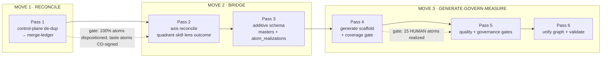

# Merge Procedure — Bringing Old (Unspun) and New (Fête) Together

**Reads on:** [`merge-analysis.md`](./merge-analysis.md) (incl. Addendum B partner
amendments), [`crosswalk.yaml`](./crosswalk.yaml), [`fete-unifying-model.md`](./fete-unifying-model.md),
[`ADR-0001`](../decisions/ADR-0001-system-data-substrate.md).
**This doc:** *how* the two graphs actually come together — the moves, the passes, the
gates, the data mechanics. Dependency-ordered, not time-ordered.

---

## 1. What "bringing together" means here

Not a row-merge. Per Addendum B, the two collectives **stack across planes** and meet as
**two control-plane vocabularies first**, then flow down to runtime. So the merge is three
distinct moves, in order:

1. **RECONCILE** — de-duplicate the two control-plane vocabularies (Fête atoms ⇄ existing
   Unspun masters). *Produces a ledger, changes no schema.* (Amendment B1)
2. **BRIDGE** — land the additive schema that links them (masters + realization table +
   axis maps). *Reversible; touches nothing existing.* (B2)
3. **GENERATE · GOVERN · MEASURE** — make it live: the catalog instantiates each event's
   runtime scaffold, governs the risky atoms, and measures conformance. (B3, B4, B6, B8)

**The join key** is `atom_code`. **The planes** are ADR-0001's (Git control plane = atom
catalog + masters; Postgres data plane = instances). **The unified graph** is a regenerated
*projection*, never a third source of truth. **Reversibility:** every BRIDGE artifact is
additive (new tables/columns/edges), droppable without touching the keystone or the Fête
sources.

---

## 2. The six passes (each: input → action → output → gate → amendment)

### Pass 1 — Control-plane de-duplication *(the heart of the merge)*

- **Input:** `fete-graph.json` (78 atoms) × the Unspun control-plane masters
  (`Playbook`, `AICapability`, `Process`-definitions, `ExperienceStandard`,
  `ServiceStandard`, `Checklist`, `PolicyGuardrail`).
- **Action:** classify every atom against existing masters into a **disposition** (§3).
- **Output:** `merge-ledger.yaml` — `atom_code → {disposition, targets[], confidence, owner}`.
- **Gate:** 100% of 78 atoms dispositioned; every **taste-bearing** atom (TST skill / HUMAN
  quadrant) signed by the CD; conflicts logged.
- **Amendment:** B1. *This is where "bringing together" actually happens — most atoms
  reconcile to things Unspun already has; the merge is mostly recognition, not creation.*

### Pass 2 — Axis reconciliation

- **Input:** Pass-1 ledger + Fête axes (quadrant, skill, lens, outcome).
- **Action:** map axes to Unspun: `quadrant → AICapability binding` (Addendum B5 table);
  `skill → Role/competency`; `lens G1–G7 → Unspun classification axes`; `outcome R1–R15 →
  ExperienceStandard.dimensions + Moment`.
- **Output:** an `outcomes` master spec + the `automation_quadrant` enum + axis-map notes.
- **Gate:** quadrant **drift resolved** — per-atom tag adopted as source of truth, Atlas
  roll-up refreshed (crosswalk `C1`).
- **Amendment:** B5; resolves the within-Fête conflict.

### Pass 3 — Land the additive bridge schema

- **Input:** Passes 1–2.
- **Action:** apply the catalog + SQL deltas: `atoms` + `outcomes` masters,
  `automation_quadrant` enum, **`atom_realizations` link table** (B2), convenience
  `atom_code`/`quadrant` columns, new objects `SensoryCue` + `ChildFlowStation`,
  `governance_bound` flag, `stage_boh` flag.
- **Output:** updated `../data-model/catalog/*.yaml` + `../data-model/sql/*` (additive only).
- **Gate:** schema applies clean on a fresh DB; existing keystone tables untouched;
  rollback = drop the new objects.
- **Amendment:** B2.

### Pass 4 — Generate the scaffold + coverage gate *(makes it bidirectional)*

- **Input:** the `atoms` master + an `Event` (with `ServiceTier` × type).
- **Action:** the catalog **instantiates** the runtime `Process`/`Task`/required-`AICapability`
  graph for that event (the required atom set), writing `atom_realizations` rows; runtime
  then reports realization status back.
- **Output:** an instantiated, atom-linked event project; live conformance data.
- **Gate:** the **15 HUMAN brand-critical atoms** must show planned→realized; an event that
  can't blocks `event_state → confirmed` / `reviewed`.
- **Amendment:** B3. *Catalog → generates → runtime → reports coverage → catalog.*

### Pass 5 — Quality + governance gates

- **Input:** instantiated atoms + their benchmark / failure-mode / governance flags.
- **Action:** for atoms that are **G3 (brand-destroying/irreversible) or HUMAN/AUG-HITL**,
  emit a runtime `CheckDefinition` from the benchmark and a `Risk`/check from the
  failure-mode; everything else is logged. For **governance-bound atoms (T03–T05 + any
  `inferred/enriched/scraped`)**, the `atom_realizations` row must carry a valid
  `consent_id` + `lawful_basis` or the realization is **refused**.
- **Output:** runtime checks + enforced consent gates; benchmark verdicts feeding
  `ExceptionalityScore`.
- **Gate:** HUMAN-quadrant invariant holds (no `AICapability` in the customer loop);
  governance gate refuses un-consented enrichment.
- **Amendment:** B4, B5 (invariant), B6.

### Pass 6 — Unify the graph + validate

- **Input:** `kg.json` (nouns) + `fete-graph.json` (verbs) + `atom_realizations`.
- **Action:** regenerate **one** graph: add `realizes` (runtime→atom) and reuse `serves`
  (atom→outcome) edges, joined on `atom_code` — no node duplication. Stand up validators.
- **Output:** `unified-graph.json` (a projection) + a conformance/drift report.
- **Gate (Ethos T2):** **conformance** (% required atoms realized; 100% of the 15 HUMAN),
  **drift detector** (dead templates never realized; runtime work with no atom), **version
  pinning** confirmed (events pin `atom_version`; bumps via `ChangeOrder`).
- **Amendment:** B7, B8.

---

## 3. Pass-1 mechanics: the disposition taxonomy + seed ledger

Every atom gets exactly one disposition. **This is the merge** — it decides what is *new*
vs what already *exists* under another name.

| Disposition | Meaning | Action |
|---|---|---|
| **EXISTING** | atom already is an Unspun master under another name | link `atom_code` → master; create no new master |
| **DECOMPOSE** | atom spans several existing masters | link → cluster; `atom_realizations` carries the spread |
| **NEW-MASTER** | genuinely new control-plane concept | create `atoms`/object row |
| **GAP-IN-FÊTE** | Unspun master with no atom | flag; not all masters need an atom |

**Seed ledger (cluster-level; Pass 1 refines to per-atom, CD-signed):**

| Cluster (atoms) | Disposition | Reconciles to (Unspun master) |
|---|---|---|
| intake/enrich T01–T05 | EXISTING | `AICapability` (ingest/qualify/enrich/infer/discretion) + `ProfileSignal`/`Consent` rules |
| discovery/trust T06–T10 | NEW-MASTER (relationship rituals) | new atoms; `T08` → existing `Tastemaker`; `T10` → `Touchpoint/Thread` + "named owner" (B-gap) |
| taste/moodboard T11–T15,T19,T27 | EXISTING/DECOMPOSE | `TasteProfile`,`PreferenceModel`,`Concept`,`ConceptVariant`,`Motif`,`InspirationSource` |
| vendor T16–T18,T29–T34 | EXISTING | `AICapability:VendorRecommendation`,`Vendor*`,`Quote`,`Booking`,`VendorContract`,`VendorUser` |
| budget/discretion T20–T24 | EXISTING | `Budget`,`PricingPlan`,`Proposal`,`Contract`,`Consent`/`DiscretionPolicy` |
| run-of-show T35–T41,T48,T53 | DECOMPOSE | `Program`,`Beat`,`LogisticsPlan`,`Task`,`Dependency`,`Process`,`Contingency`; **NEW** `SensoryCue`(T38),`ChildFlowStation`(T36) |
| day-of T49–T62 | EXISTING/DECOMPOSE | `Shift`,`ResourceAssignment`,`AccessPass`,`SupervisionPlan`,`Incident`; **NEW** custody atoms (T56,T62) |
| media/album T46–T47,T58–T67 | EXISTING | `MediaPlan`,`MediaCrew`,`ShotList`,`Shot`,`MediaGallery` |
| loop/compounding T68–T78 | EXISTING/NEW | `Referral`,`Showcase`,`VendorPerformance`,`Roster`,`ClientProfile`,`Playbook`,`KnowledgeAsset`,`BrandAsset`; **NEW** `T78` handwritten note |

**Adjudication rule:** EXISTING/DECOMPOSE on logistics/ops atoms → planner/dev sign-off;
anything TST or HUMAN-quadrant → **CD sign-off required** (taste cannot be auto-reconciled).

---

## 4. How a single atom actually "comes together" (worked trace)

**T35 — Author run-of-show** (AUG-HITL · WS5 · serves R7,R8):
1. **Reconcile:** DECOMPOSE → `Playbook(ROS)` + `Process`-def (existing). No new master.
2. **Bridge:** `atoms` row `T35@v1`, `quadrant=aug_hitl`, `serves_outcome_codes=[R7,R8]`.
3. **Generate:** at event instantiation it emits `Program` + `Beat`s + `Task(author ROS)` +
   `Dependency`s; `atom_realizations` links `T35@v1 → {prg_… (primary), bet_…, tsk_…}`.
4. **Govern/Quality:** AUG-HITL ⇒ benchmark "reads like a script of *this* party" becomes a
   `CheckDefinition`; the agent drafts the ROS as a `Suggestion` → `HumanReview` before it's
   used. Not governance-bound (no PII).
5. **Unify/Measure:** graph edge `tsk_… realizes T35`; `T35 serves R7,R8`; the check verdict
   rolls into the event `ExceptionalityScore`.

**T04 — Aesthetic inference** (AUG-HITL · governance-bound):
1. **Reconcile:** EXISTING → `AICapability:aesthetic-posture-inference`.
2. **Govern (Pass 5):** `capture_method=inferred` on a household that includes a **minor** ⇒
   realization **refused** unless the `atom_realizations` row carries `consent_id` +
   `lawful_basis` (B6). Governance is *bound*, not inherited.

These two traces are the whole pattern: *recognize → link → generate → gate → measure.*

---

## 5. Conflict handling during the merge

| Conflict | Rule |
|---|---|
| Quadrant drift (Atlas vs decomposition) | per-atom tag wins; refresh Atlas (`C1`) |
| Grain (atom spans many entities) | `atom_realizations` table, not a single FK (B2) |
| Quality grain (atom benchmark vs event score) | per-atom `CheckResult` → roll up to `ExceptionalityScore` |
| Two masters claim one atom (de-dup ambiguity) | human adjudication; CD for taste, planner for ops |
| Atom changes mid-event | event pins `atom_version`; adopt new via `ChangeOrder` (B7) |
| New drift source risk | unified graph is a regenerated projection, never edited (B7) |

---

## 6. What this produces (the deliverables of the merge)

- `merge-ledger.yaml` — the per-atom disposition (Pass 1).
- additive deltas to `../data-model/catalog` + `../data-model/sql` — `atoms`/`outcomes`
  masters, `automation_quadrant`, `atom_realizations`, `SensoryCue`/`ChildFlowStation`,
  `governance_bound`/`stage_boh` (Pass 3).
- a catalog→runtime **instantiator** + the coverage gate (Pass 4).
- check/governance gates (Pass 5).
- `unified-graph.json` + conformance/drift report (Pass 6).

**Next executable step (Move 1):** produce `merge-ledger.yaml` — walk all 78 atoms to a
disposition against the existing masters, CD-signing the taste atoms. That ledger is the
prerequisite the partner named, and the literal act of bringing the two together. Say go and
I'll generate it.
